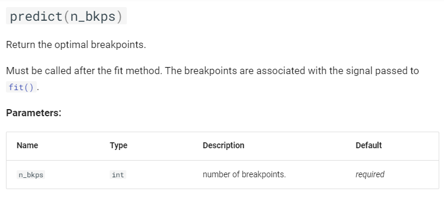

# Raptures
## Metodi di ricerca
### Pelt
Rilevamento del punto di cambio penalizzato.

Per un dato modello e livello di penalità, calcola la segmentazione che riduce al minimo la somma vincolata degli errori di approssimazione.

Parametri:


Predict parametri:


### BinarySeg

Algoritmo di segmentazione binaria (Binseg) fornito dalla libreria ruptures in Python. Questa libreria è comunemente utilizzata per rilevare cambiamenti o discontinuità in serie temporali o sequenze di dati.


Parametri:


Predict parametri:


### Dynp
Trova punti di cambiamento ottimali utilizzando la programmazione dinamica.

Dato un modello di segmento, calcola la partizione migliore per la quale la somma degli errori è minima.

Parametri:


Predict parametri:



## Spiegazione Parametri
### Model
Specifica il modello di rilevamento dei cambiamenti utilizzato.

Esistono diversi tipi di modelli:

+ ***l1*** (Least Absolute Deviation): Questo metodo minimizza la somma degli scarti assoluti tra i punti dati e la linea di regressione. È utile quando si desidera una robustezza maggiore agli outlier rispetto al metodo dei minimi quadrati.
+ ***l2*** (Least Squared deviation): Questo metodo minimizza la somma degli scarti quadrati tra i punti dati e la linea di regressione. È sensibile agli outlier, ma può essere influenzato in modo significativo da essi.
+ ***rbf*** (Kernelized mean change): Questo metodo utilizza una funzione kernel per calcolare la similarità tra i segmenti di dati. È particolarmente utile quando i cambiamenti non sono necessariamente lineari e quando è importante catturare i cambiamenti non solo in valore ma anche in forma.
+ ***normal*** (Gaussian process change): Questo metodo utilizza un processo gaussiano per modellare i dati e individuare i cambiamenti. È utile quando si desidera modellare la correlazione tra i dati e avere una stima della distribuzione dei cambiamenti.
+ ***CostCosine*** (CostCosine): Questo metodo calcola il costo del cambiamento utilizzando la similarità coseno tra i segmenti di dati. Può essere utile quando si desidera rilevare cambiamenti basati sulla direzione dei vettori dei dati.
+ ***linear*** (Linear model change): Questo metodo assume che i dati seguano un modello lineare e cerca i punti in cui il modello cambia. È utile quando si sospetta che i cambiamenti seguano un modello lineare.
+ ***clinear*** (Continuous linear change): Questo metodo assume che i cambiamenti seguano un modello lineare ma possono essere continui nel tempo. È utile quando si desidera rilevare cambiamenti graduati e non repentini.
+ ***rank*** (Rank-based change): Questo metodo si basa sulle classifiche dei dati anziché sui valori effettivi. È utile quando si desidera rilevare cambiamenti nella distribuzione dei dati piuttosto che nei valori stessi.
+ ***mahalanobis*** (Mahalanobis-type change): Questo metodo utilizza la distanza di Mahalanobis per valutare i cambiamenti nei dati. È particolarmente utile quando i dati hanno correlazioni e varianze diverse.
+ ***ar*** (Autoregressive model change): Questo metodo utilizza modelli autoregressivi per rilevare cambiamenti nei dati nel tempo. È utile quando i dati hanno una struttura temporale e si desidera modellare le dipendenze temporali per rilevare i cambiamenti.
+ ***costum*** (Custom): il modello costum consente agli utenti di definire manualmente una funzione di costo personalizzata per identificare i cambiamenti nei dati. Offre una maggiore flessibilità nella definizione dei criteri di cambiamento.

## Custom Cost

La funzione error() nella classe MyCost è il cuore del calcolo del costo personalizzato per la rilevazione dei punti di rottura. Vediamo i dettagli della sua implementazione:

```
class MyCost(BaseCost):
    """Custom cost for percentage difference between segment medians."""
    model = ""
    min_size = 2

    def fit(self, signal):
        """Set the internal parameter."""
        self.signal = signal
        return self

    def error(self, start, end):
        """Return the approximation cost on the segment [start:end]."""
        segment = self.signal[start:end]
        segment_mean = np.mean(segment)
        absolute_diff = np.abs(segment - segment_mean)
        cost = np.sum(absolute_diff)
        return cost
```


La funzione error() accetta due argomenti, start e end, che indicano gli indici di inizio e fine del segmento di interesse all'interno del segnale.

Calcolo del segmento: Viene estratto il segmento di segnale specificato dagli indici start e end. Questo segmento rappresenta la porzione del segnale su cui calcoleremo il costo del punto di rottura.

```
segment = self.signal[start:end]
```

Calcolo della media del segmento: Viene calcolata la media del segmento. Questo ci fornisce un valore rappresentativo per il segmento.

```
segment_mean = np.mean(segment)
```

Calcolo della differenza assoluta rispetto alla media: Viene calcolata la differenza assoluta tra ciascun punto del segmento e la media del segmento. Questo ci fornisce una misura di quanto ciascun punto si discosti dalla media del segmento.

```
absolute_diff = np.abs(segment - segment_mean)
```

Calcolo del costo totale: La somma delle differenze assolute calcolate nel passaggio precedente rappresenta il costo del segmento. Questo valore può essere considerato come una misura di quanto il segmento differisca dalla sua media.

```
cost = np.sum(absolute_diff)
```

Restituzione del costo: Il costo calcolato viene restituito come risultato della funzione error(). Questo valore sarà utilizzato dall'algoritmo di rilevamento dei punti di rottura per valutare la bontà della segmentazione in corrispondenza del punto di rottura specificato.

```
return cost
```

In sintesi, la funzione error() calcola il costo di un segmento di segnale specifico, che è la somma delle differenze assolute tra ciascun punto del segmento e la media del segmento stesso. Questo costo personalizzato viene quindi utilizzato per guidare l'algoritmo di rilevamento dei punti di rottura nella ricerca dei punti di rottura ottimali nella serie temporale.


## TODO
- aggiungere un esempio con metodo custom
- capire iperparametri e vedere se ce ne sono altri utilizzabili
