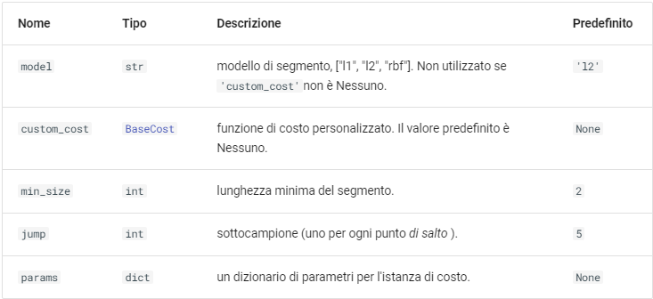
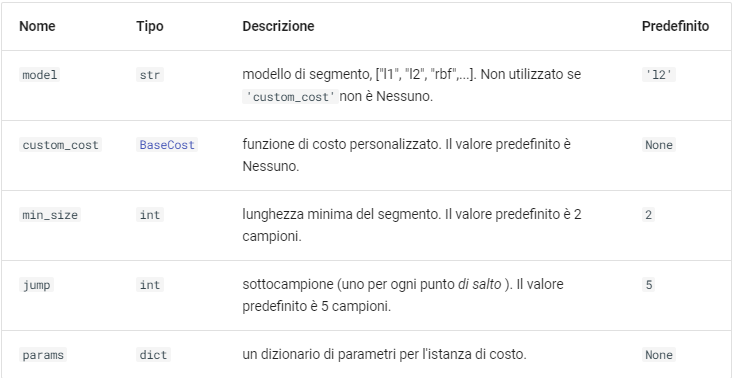
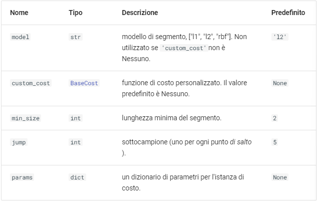

# Raptures

## Pelt
Rilevamento del punto di cambio penalizzato.

Per un dato modello e livello di penalità, calcola la segmentazione che riduce al minimo la somma vincolata degli errori di approssimazione.


***Model*** specifica il modello di rilevamento dei cambiamenti utilizzato.

Esistono diversi tipi di modelli:

+ ***l1*** (Least Absolute Deviation): questo modello utilizza la deviazione assoluta minima per identificare i punti di cambiamento nei dati. È robusto alla presenza di outlier e può essere utilizzato quando si desidera una stima più resistente agli errori. 
+ ***l2*** (Least Squares): il modello l2 utilizza il metodo dei minimi quadrati per identificare i punti di cambiamento. Si basa sulla minimizzazione della somma dei quadrati delle differenze tra i dati osservati e i valori previsti. È sensibile agli outlier. 
+ ***rbf** (Radial Basis Function): questo modello utilizza le funzioni a base radiale per identificare i cambiamenti nei dati. Le funzioni a base radiale sono funzioni il cui valore dipende dalla distanza radiale dal centro. È utile quando si desidera una flessibilità maggiore nella modellazione dei dati. 
+ ***linear*** (Segmentation): il modello linear segmenta i dati in segmenti lineari e cerca di minimizzare la somma dei quadrati delle differenze tra i dati osservati e i valori previsti. È un modello semplice ma efficace per identificare i cambiamenti nei dati. 
+ ***pruned_bayes*** (Pruned Bayesian): questo modello utilizza un approccio bayesiano per identificare i punti di cambiamento nei dati. Si basa sull'uso di modelli probabilistici e può essere utile quando si desidera una maggiore flessibilità nella modellazione dei dati. 
+ ***binary_segmentation*** (Binary Segmentation): il modello binary_segmentation divide iterativamente i dati in due segmenti, cercando di minimizzare l'errore quadratico tra i segmenti. È un approccio semplice e computazionalmente efficiente per il rilevamento dei cambiamenti. 
+ ***window*** (Window-based): questo modello considera finestre di dati di dimensioni fisse e cerca cambiamenti all'interno di queste finestre. È utile quando si desidera limitare l'analisi a segmenti specifici dei dati. 
+ ***costume*** (Custom): il modello costume consente agli utenti di definire manualmente una funzione di costo personalizzata per identificare i cambiamenti nei dati. Offre una maggiore flessibilità nella definizione dei criteri di cambiamento.

***Jump*** specifica la dimensione massima di un cambiamento.

Es jump=20, significa che l'algoritmo cercherà cambiamenti che abbiano una dimensione maggiore o uguale ai 20 punti dati.

```
pelt = rp.Pelt(model="l1", jump=20)
bkps_pelt = pelt.fit_predict(data, 30)
```

***Pelt.fit_predict***: si utilizza per predirre i punti di cambiamento.
In questo caso 30 specifica il numero massimo di cambiamenti che ci si aspetta di trovare nei dati.

Parametri:




## BinarySeg

Algoritmo di segmentazione binaria (Binseg) fornito dalla libreria ruptures in Python. Questa libreria è comunemente utilizzata per rilevare cambiamenti o discontinuità in serie temporali o sequenze di dati.

Esistono diversi tipi di modelli:
+ ***L0***: Questo modello utilizza il numero di cambiamenti come criterio per valutare la qualità della segmentazione. Cerca di minimizzare il numero di segmenti necessari per adattarsi ai dati. 
+ ***L1***: Questo modello utilizza la somma delle differenze assolute come criterio per valutare la qualità della segmentazione. Cerca di minimizzare la somma delle differenze assolute tra i dati effettivi e i dati predetti all'interno di ciascun segmento. 
+ ***L2***: Questo modello utilizza la somma dei quadrati delle differenze come criterio per valutare la qualità della segmentazione. Cerca di minimizzare la somma dei quadrati delle differenze tra i dati effettivi e i dati predetti all'interno di ciascun segmento.

```
algo = rp.Binseg(model="l2", jump=1000).fit(data)
bkps_binSeg = algo.predict(pen=30)
```

***Algo*** rappresenta l'algoritmo di segmentazione binaria.

Il parametro ***n_bkps*** indica il numero desiderato di punti di rottura da predire, che in questo caso è 3. La funzione restituirà quindi un array contenente le posizioni dei punti di rottura predetti nella serie temporale data

Parametri:





## Dynp
Trova punti di cambiamento ottimali utilizzando la programmazione dinamica.

Dato un modello di segmento, calcola la partizione migliore per la quale la somma degli errori è minima.

Parametri:




## TODO
- aggiungere un esempio con metodo custom
- usare altri dataset che ci passa il prof
- capire iperparametri e vedere se ce ne sono altri utilizzabili